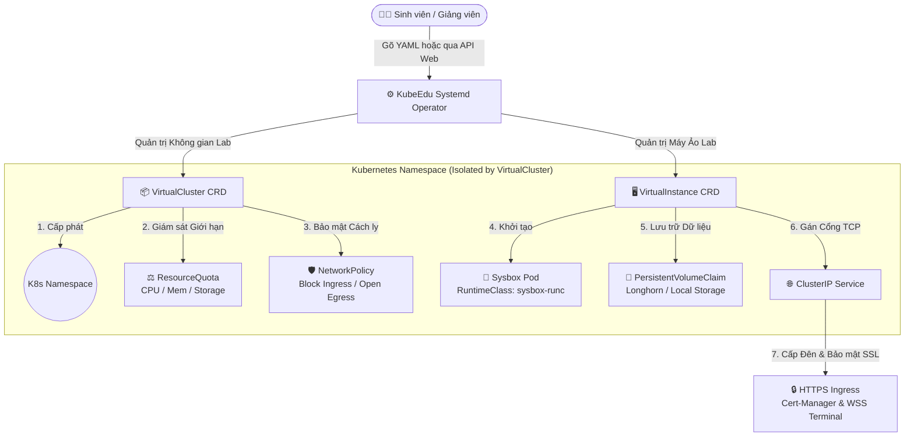

# 🚀 KubeEdu Systemd Operator — Cloud-Native Practical Lab & Sandbox Platform

   

**KubeEdu Systemd Operator** là bộ điều khiển Kubernetes (Kubernetes Operator) tiêu chuẩn doanh nghiệp của hệ sinh thái **KubeEdu**, chuyên tự động hóa việc khởi tạo và quản trị nền tảng phòng thí nghiệm & Sandbox (Cloud-Native Lab Platform) trên điện toán đám mây, phục vụ tối ưu cho mục đích đào tạo thực thao (University Practical Labs, Coding Bootcamps, DevSecOps Cyber-Range). 

Hệ thống tích hợp sâu với **Sysbox Runtime** để vận hành các máy ảo Container (System Containers / Docker-in-Docker với đầy đủ `systemd` gốc) ngay bên trong Kubernetes Pod với hiệu năng cao nhạy bén như máy chủ vật lý, hỗ trợ trọn vẹn kết nối Terminal/VSCode qua Web (WebSocket Secure).

---

## 🏛️ Kiến Trúc Hệ Thống & Tài Nguyên Tùy Chỉnh (CRDs)

Hệ thống hoạt động dựa trên 2 thực thể Custom Resources chính:



### 1. `VirtualCluster` — Cụm Phòng Lab Độc Lập
* **Cách ly vô song (Multi-Tenant Isolation):** Tự động sinh Kubernetes Namespace chuẩn RFC 1123 đi kèm với **NetworkPolicy** (Mặc định cho phép 100% kết nối Egress để sinh viên thoải mái `docker pull`, `git clone`, `apt install`, nhưng phong tỏa chặt chẽ Ingress để chống rò rỉ dữ liệu hay gian lận thi cử giữa các phòng lab).
* **Quản trị ranh giới tài nguyên (Resource Quotas):** Áp đặt khắt khe giới hạn tối đa CPU, RAM, Storage và số lượng Object thông qua bộ chuẩn `resource.Quantity` chính quy của Kubernetes.
* **Quy tắc Finalizer-First & Hết hạn thông minh (TTL Anti-Drift):** Cam kết đảm bảo dọn sạch sẽ tài nguyên khi xóa cụm thông qua OwnerReferences và tự động giải tán phòng Lab sau thời gian quy định (`ttl` như `4h`, `120m`) nhằm chống ùn đọng rác trên Cluster.

### 2. `VirtualInstance` — Máy Ảo Thực Thao Sysbox-Ready
* **Động cơ Sysbox (`sysbox-runc`):** Vận hành container như một hệ điều hành trọn vẹn (cho phép chạy systemd, Docker, Kubernetes K8s-in-K8s bên trong Pod mà không cần cờ đặc quyền nhạy cảm `privileged: true`).
* **Hạ tầng Lưu trữ & Truy Cập Động:** 
  * Tự động phán đoán và quy hoạch lớp lưu trữ (`StorageClass`) và lớp điều hướng (`IngressClass`) với 3 tầng ưu tiên: **Biến môi trường ENV > Tùy chỉnh trong Spec > Mặc định hệ thống**.
  * Tự động xuất xưởng Domain HTTPS đi kèm chứng chỉ TLS hợp lệ (Cert-Manager) và luồng băng thông **WSS (WebSocket Secure)** tương thích 100% với các dịch vụ Terminal Web-based (như `ttyd`, `code-server`).

---

## 🏗️ Hướng Dẫn Kích Hoạt Cụm K3s & Sysbox (Ansible Kubespray-Style)

Hệ thống được trang bị sẵn bộ engine Ansible tối ưu hóa theo quy chuẩn phong cách **Kubespray**, giúp bạn biến hàng tá máy chủ thô (Bare-metal / VM) thành cụm Lab K3s chạy Sysbox chỉ trong vài phút!

### Cây Thư Mục Khởi Tạo Cụm (`ansible/k3s/`)
```text
ansible/k3s/
├── ansible.cfg                    # Cấu hình Ansible tối ưu SSH Pipelining & Callback
├── cluster.yml                    # 🚀 Playbook chính: Trí tuệ nhận diện Single-Node & Multi-Node
├── k3s-setup.yaml                 # 📜 Bản gốc Single-Node để tiện mở so sánh đối chiếu
├── inventory/                     # Kho Phân Cực Môi Trường (Environment Segmentation)
│   └── lab-cluster/               
│       ├── hosts.ini              # Danh sách IP máy chủ Master và Workers
│       └── group_vars/            # Kho cấu hình biến toàn bộ cụm (K3s version, Sysbox flags)
└── roles/                         # Bộ động cơ tự động hóa chuyên sâu
    ├── common/                    # Setup Linux kernel (shiftfs, userns, lxcfs, containerd)
    ├── k3s-master/                # Cài đặt Kube-apiserver & Trích xuất mã chứng thực Cluster
    ├── k3s-worker/                # Cài đặt Agent & Ghép nối Worker vào cụm trung tâm
    └── sysbox/                    # Nạp DaemonSet Sysbox & Đăng ký RuntimeClass K8s
```

### Cách Thực Thi Khởi Tạo Cụm

#### Bước 1: Khai báo địa chỉ IP máy chủ
Mở file cấu hình danh sách máy chủ **`ansible/k3s/inventory/lab-cluster/hosts.ini`** và điền IP thực tế của bạn:

* **Trường hợp 1 (Chạy thử nghiệm 1 Máy Độc Lập - Single Node):** 
  Chỉ cần điền 1 máy bên dưới `[k3s_master]` và để trống `[k3s_workers]`. Hệ thống sẽ nhận diện tự động và cài gộp trọn bộ hạ tầng vào Node này.
* **Trường hợp 2 (Triển khai phòng Lab Đa Máy Chủ - Cluster):**
  Điền IP máy điều hành vào `[k3s_master]` và liệt kê toàn bộ dàn máy thi cử vào mục `[k3s_workers]`.

#### Bước 2: Kích hoạt lệnh triển khai
Di chuyển vào thư mục `ansible/k3s/` và kích hoạt lệnh thi triển cơ bản:

```bash
cd ansible/k3s/
ansible-playbook cluster.yml
```

> 💡 *Nhờ cấu hình trung tâm trong `ansible.cfg`, bạn không cần truyền thêm cờ `-i inventory/lab-cluster/hosts.ini`. File cấu hình `k3s.yaml` sau khi hoàn tất sẽ tự động tải thẳng về máy tính điều khiển của bạn để thao tác qua `kubectl`!*

---

## 🛠️ Hướng Dẫn Phát Triển & Triển Khai Operator

### 1. Yêu cầu Tiền quyết (Prerequisites)
* **Go:** `v1.26.0+`
* **Docker:** `17.03+`
* **Kubernetes Cluster:** `v1.32+` (Cụm K3s tạo từ bước trên hoặc dàn Kind/Envtest để test local).

### 2. Kiểm Thử & Kiểm Soát Ngữ Pháp Mã Nguồn (Testing & Linting)
Trong quá trình bổ sung hoặc chỉnh sửa code Controller:
```bash
# Tự động định dạng lại code chuẩn và sửa lỗi lint:
make lint-fix

# Sinh lại các tệp CRD YAML và DeepCopy sau khi sửa đổi spec:
make manifests generate

# Kích hoạt bộ kiểm thử tự động Unit test qua Envtest (Ginkgo/Gomega):
make test
```

### 3. Đưa Operator Lên Cụm K3s Thực Chiến

#### Cách 1: Cài đặt Siêu Tốc với một dòng lệnh (Single-Command Install)
Dành cho người dùng cuối (End-users / Admin Cụm K8s), chỉ cần chạy duy nhất một lệnh thông qua file bundle `install.yaml` đã đóng gói sẵn trong kho chứa:
```bash
kubectl apply -f https://raw.githubusercontent.com/KubeEdu/systemd-operator/main/dist/install.yaml
```
> 💡 *File `dist/install.yaml` được tự động sinh ra bằng lệnh `make build-installer IMG=...` và đã được đóng gói tự động hóa 100% trong chu trình GitHub Actions CI/CD Pipeline mỗi khi có phiên bản mới!*

#### Cách 2: Triển khai cho Nhà Phát Triển từ Mã Nguồn (Developer Mode)
**Bước 1: Biên dịch và đẩy Docker Image của Operator lên Registry:**
```bash
export IMG="ghcr.io/kubeedu/systemd-operator:v1.0.0"
make docker-build docker-push IMG=$IMG
```

**Bước 2: Triển khai trực tiếp bằng Kustomize / Makefile:**
```bash
make install
make deploy IMG=$IMG
```

---

## 📦 Ví Dụ Kịch Bản Sử Dụng Nhanh (Quickstart Samples)

### 1. Khởi tạo một Cụm Phòng Lab (`VirtualCluster`) cho Sinh viên
Tạo file `sample-virtualcluster.yaml`:
```yaml
apiVersion: lab.devops.toiyeuptit.com/v1alpha1
kind: VirtualCluster
metadata:
  name: student-devops-lab01
  namespace: default
  labels:
    student_id: "sv-2026-001"
    lab_id: "lab-k8s-basics"
spec:
  ttl: "4h"            # Tự động dọn trọn gói phòng Lab sau 4 tiếng
  network:
    type: "external"   # 'external' (mở toang tiện dụng) hoặc 'internal' (cách ly thi cử)
  quota:
    compute:
      cpu:
        limit: "4"     # 4 vCPU
      memory:
        limit: "8Gi"   # 8GB RAM
    storage:
      localLimit: "50Gi"
      networkLimit: "20Gi"
    objects:
      podsLimit: 20
      servicesLimit: 10
```
Áp dụng lên K8s: `kubectl apply -f sample-virtualcluster.yaml`

---

### 2. Khởi tạo Máy Ảo Thực Thao (`VirtualInstance`) kèm Terminal Web
Tạo file `sample-virtualinstance.yaml`:
```yaml
apiVersion: lab.devops.toiyeuptit.com/v1alpha1
kind: VirtualInstance
metadata:
  name: ubuntu-sysbox-devbox
  namespace: default
spec:
  virtualClusterRef: student-devops-lab01
  image: "ubuntu:24.04"      # Image chuyên dụng cho môn học/thi cử
  runtimeClassName: "sysbox-runc"
  resources:
    cpu:
      request: "1"
      limit: "2"
    memory:
      request: "2Gi"
      limit: "4Gi"
  storage:
    root:
      size: "15Gi"
      type: local            # Ổ Root I/O cực cao từ local-path
    dataVolumes:
      - name: docker-data
        mountPath: /var/lib/docker
        size: "20Gi"
        type: network        # Ổ Dữ liệu lưu vết phân tán từ longhorn
  ports:
    - name: web-terminal
      port: 80
      targetPort: 7681       # Cổng ttyd terminal bên trong Pod
      expose: true           # Tự động cấp domain HTTPS WSS qua Cert-Manager
```
Áp dụng lên K8s: `kubectl apply -f sample-virtualinstance.yaml`

---

## 🔍 Khung Quan Sát Cấu Hình Môi Trường (Environment Variables)

Bộ điều khiển Operator có khả năng tinh chỉnh linh hoạt lớp lưu trữ (Storage Class) và bộ điều hướng (Ingress Controller) của Cụm thông qua các biến môi trường cấu hình tại Pod của Controller Manager (hoặc file `.env` / `.env.example`):

| Biến Môi Trường (`ENV_VAR`) | Giá Trị Mặc Định Khi Không Khai Báo | Ý Nghĩa & Vai Trò Trong Hệ Thống |
| :--- | :--- | :--- |
| `DEFAULT_LOCAL_STORAGE_CLASS` | `local-path` | Tên của StorageClass mặc định trong K3s dùng cho ổ cứng SSD Nội bộ. |
| `DEFAULT_NETWORK_STORAGE_CLASS` | `longhorn` | Tên của StorageClass phân tán, lưu trữ dữ liệu sinh viên bền vững lâu dài. |
| `DEFAULT_INGRESS_CLASS` | `nginx` | Trình điều hướng traffic mặc định, hỗ trợ tối đa WebSockets (WSS). |
| `DEFAULT_RUNTIME_CLASS` | `sysbox-runc` | Định danh runtime engine chạy container-in-container bên trong K8s. |

---

## 📜 Giám Sát Tự Động & Dọn Rác (Observability & Cleanup)

* Toàn bộ tiến độ giải ngân tài nguyên (`Conditions`) và lưu lượng đã dùng (`QuotaUsage`) đều được theo dõi thời gian thực:
  ```bash
  kubectl get virtualcluster,virtualinstance -A -o wide
  ```
* **Bảo đảm Dọn Sạch Sẽ (Garbage Collection):** Xóa `VirtualCluster` gốc sẽ phát đi tín hiệu qua Garbage Collector K8s tự động dọn sạch an toàn toàn bộ Pods, PVCs, NetworkPolicies và Services trong Namespace tương ứng!

---
*Phát triển bởi Đội ngũ Kiến Trúc Sư Hệ Thống — **ToiYeuPTIT Dev** (2026).*  
*Licensed under the Apache License, Version 2.0.*
