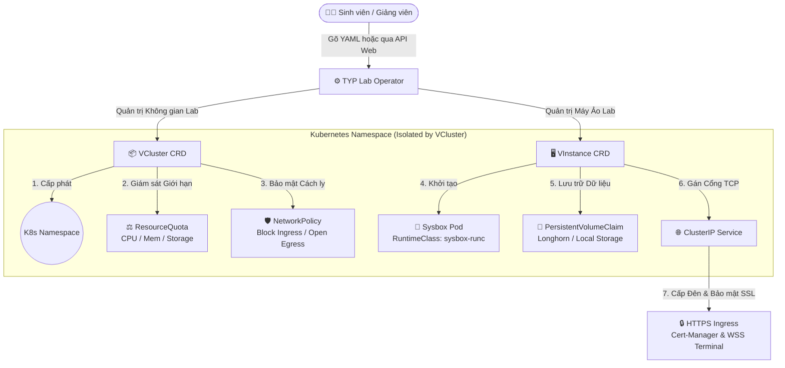

# 🚀 TYP Kubernetes Lab Platform Operator

   

**TYP Kubernetes Lab Platform Operator** là hệ thống nền tảng tự động hóa quản trị phòng thí nghiệm điện toán mây (Cloud-Native Lab Platform) tiêu chuẩn doanh nghiệp, được thiết kế chuyên biệt cho môi trường đào tạo thực thao (University Practical Labs, Coding Bootcamps, DevSecOps Cyber-Range). 

Hệ thống tích hợp sâu với **Sysbox Runtime** để vận hành các máy ảo Container (System Containers / Docker-in-Docker) ngay bên trong Kubernetes Pod với hiệu năng cao nhạy bén như máy chủ vật lý, hỗ trợ trọn vẹn kết nối Terminal/VSCode qua Web (WebSocket Secure).

---

## 🏛️ Kiến Trúc Hệ Thống & Tài Nguyên Tùy Chỉnh (CRDs)

Hệ thống hoạt động dựa trên 2 thực thể Custom Resources chính:



### 1. `VCluster` — Cụm Phòng Lab Độc Lập
* **Cách ly vô song (Multi-Tenant Isolation):** Tự động sinh Kubernetes Namespace chuẩn RFC 1123 đi kèm với **NetworkPolicy** (Mặc định cho phép 100% kết nối Egress để sinh viên thoải mái `docker pull`, `git clone`, `apt install`, nhưng phong tỏa chặt chẽ Ingress để chống rò rỉ dữ liệu hay gian cãi thi cử giữa các phòng lab).
* **Quản trị ranh giới tài nguyên (Resource Quotas):** Áp đặt khắt khe giới hạn tối đa CPU, RAM, Storage và số lượng Object thông qua bộ chuẩn `resource.Quantity` chính quy của Kubernetes.
* **Quy tắc Finalizer-First & Hết hạn thông minh (TTL Anti-Drift):** Cam kết đả bảo sạch sẽ tài nguyên khi xóa cụm thông qua OwnerReferences và tự động giải tán phòng Lab sau thời gian quy định (`ttlMinutes`) nhằm chống ùn hụt rác trên Cluster.

### 2. `VInstance` — Máy Ảo Thực Thao Sysbox-Ready
* **Động cơ Sysbox (`sysbox-runc`):** Vận hành container như một hệ điều hành trọn vẹn (cho phép chạy systemd, Docker, Kubernetes K8s-in-K8s bên trong Pod mà không cần cờ đặc quyền nhạy cảm `privileged: true`).
* **Hạ tầng Lưu trữ & Truy Cập Động:** 
  * Tự động phán đoán và quy hoạch lớp lưu trữ (`StorageClass`) và lớp điều hướng (`IngressClass`) với 3 tầng ưu tiên: **Biến môi trường ENV > Tùy chỉnh trong Spec > Mặc định hệ thống**.
  * Tự động xuất xưởng Domain HTTPS đi kèm chứng chỉ TLS hợp lệ (Cert-Manager) và luồng băng thông **WSS (WebSocket Secure)** tương thích 100% với các dịch vụ Terminal Web-based (như `ttyd`, `code-server`).

---

## 🏗️ Hướng Dẫn Kích Hoạt Cụm K3s & Sysbox (Ansible Kubespray-Style)

Hệ thống được trang bị sẵn bộ engine Ansible tối ưu hóa theo quy chuẩn phong cách **Kubespray**, giúp bạn biến hàng tá máy chủ thô (Bare-metal / VM) thành cụm Lab K3s chạy Sysbox chỉ trong 2 phút!

### Cây Thư Mục Khởi Tạo Cụm (`ansible/k3s/`)
```text
ansible/k3s/
├── ansible.cfg                    # Cấu hình Ansible tối ưu SSH Pipelining & Callback
├── cluster.yml                    # 🚀 Playbook chính: Trí tuệ nhận diện Single-Node & Multi-Node
├── k3s-setup.yaml                 # 📜 Bản gốc Single-Node để tiện mở so sánh đối chiếu
├── inventory/                     # Kho phân cực Môi trường (Environment Segmentation)
│   └── lab-cluster/               
│       ├── hosts.ini              # Danh sách IP máy chủ Master và Workers
│       └── group_vars/            # Kho cấu hình biến toàn bộ cụm (K3s version, Sysbox flags)
└── roles/                         # Bộ động cơ tự động hóa chuyên sâu
    ├── common/                    # Setup Linux kernel (shiftfs, userns, lxcfs, containerd)
    ├── k3s-master/                # Cài đặt Kube-apiserver & Trích xuất mã chứng thực Cluster
    ├── k3s-worker/                # Cài đặt Agent & Ghép nối Worker vào cụm trung tâm
    └── sysbox/                    # Nạp DaemonSet Sysbox & Đăng ký RuntimeClass K8s
```

### Cách Thực Thi Khởi Tạo Cụm

#### Bước 1: Khai báo địa chỉ IP máy chủ
Mở file cấu hình danh sách máy chủ **`ansible/k3s/inventory/lab-cluster/hosts.ini`** và điền IP thực tế của bạn:

* **Trường hợp 1 (Chạy thử nghiệp 1 Máy Độc Lập - Single Node):** 
  Chỉ cần điền 1 máy bên dưới `[k3s_master]` và để trống `[k3s_workers]`. Hệ thống sẽ nhận diện tự động và cài gộp trọn bộ hạ tầng vào Node này.
* **Trường hợp 2 (Triển khai phòng Lab Đa Máy Chủ - Cluster):**
  Điền IP máy điều hành vào `[k3s_master]` và liệt kê toàn bộ dàn máy thi cử vào mục `[k3s_workers]`.

#### Bước 2: Chấp nhúng lệnh triển khai thần tốc
Di chuyển vào thư mục `ansible/k3s/` và kích hoạt lệnh thi triển cơ bản (giống hệt thao tác Kubespray):

```bash
cd ansible/k3s/
ansible-playbook cluster.yml
```

> 💡 *Nhờ cấu hình trung tâm trong `ansible.cfg`, bạn không cần truyền thêm cờ `-i inventory/lab-cluster/hosts.ini`. File cấu hình `k3s.yaml` sau khi hoàn tất sẽ tự động tải thẳng về máy tính điều khiển của bạn để thao tác qua `kubectl`!*

---

## 🛠️ Hướng Dẫn Phát Triển & Triển Khai Operator

### 1. Yêu cầu Tiền quyết (Prerequisites)
* **Go:** `v1.24.6+`
* **Docker:** `17.03+`
* **Kubernetes Cluster:** `v1.30+` (Cụm K3s tạo từ bước trên hoặc dàn Kind/Envtest để test local).

### 2. Kiểm Thử & Kiểm Soát Ngữ Pháp Mã Nguồn (Testing & Linting)
Trong quá trình bổ sung hoặc chỉnh sửa code Controller:
```bash
# Tự động định dạng lại code chuẩn và sửa lỗi lint:
make lint-fix

# Sinh lại các tệp CRD YAML và RBAC Marker sau khi sửa spec:
make manifests generate

# Kích hoạt bộ kiểm thử tự động E2E / Unit test qua Envtest (Ginkgo/Gomega):
make test
```

### 3. Đưa Operator Lên Cụm K3s Thực Chiến
**Bước 1: Biên dịch và đẩy Docker Image của Operator lên Registry:**
```bash
export IMG="ghcr.io/toiyeuptit/lab-operator:v1.0.0"
make docker-build docker-push IMG=$IMG
```
 *(Nếu test trên cụm Kind, bạn có thể nạp thẳng bằng lệnh: `kind load docker-image $IMG`)*

**Bước 2: Triển khai CRDs và Controller Manager vào Cụm:**
```bash
make install
make deploy IMG=$IMG
```
> Giám sát trạng thái hoạt động của bộ điều khiển Operator:  
> `kubectl logs -n kubebuilder-system deployment/kubebuilder-controller-manager -c manager -f`

---

## 📦 Ví Dụ Kịch Bản Sử Dụng Nhanh (Quickstart Samples)

### 1. Khởi tạo một Cụm Phòng Lab (`VCluster`) cho Sinh viên
Tạo file `sample-vcluster.yaml`:
```yaml
apiVersion: lab.devops.toiyeuptit.com/v1alpha1
kind: VCluster
metadata:
  name: student-devops-lab01
  namespace: default
spec:
  owner: "msw-2026-001@toiyeuptit.com"
  ttlMinutes: 240 # Tự động dọn trọn gói phòng Lab sau 4 tiếng (240 phút)
  network:
    type: "external" # 'external' (mở toang tiện dụng) hoặc 'internal' (cách ly thi cử)
  quota:
    compute:
      cpu: "4000m"      # 4 vCPU
      memory: "8Gi"     # 8GB RAM
    storage:
      maxSize: "50Gi"   # Tổng lưu trữ tối đa cho phép
    objects:
      maxPods: 20
      maxServices: 10
      maxPersistentVolumeClaims: 5
```
Áp dụng lên K8s: `kubectl apply -f sample-vcluster.yaml`

---

### 2. Khởi tạo Máy Ảo Thực Thao (`VInstance`) kèm Terminal Web
Tạo file `sample-vinstance.yaml` (nằm trực tiếp trong Namespace vừa được sinh ra bởi `VCluster` ở trên):
```yaml
apiVersion: lab.devops.toiyeuptit.com/v1alpha1
kind: VInstance
metadata:
  name: ubuntu-sysbox-devbox
  namespace: lab-student-devops-lab01
spec:
  vClusterName: student-devops-lab01
  image: "ubuntu:24.04" # Hoặc Image chuyên dụng có tích hợp sẵn 'ttyd' / Docker
  cpu: "2000m"
  memory: "4Gi"
  storage:
    size: "20Gi"
    path: "/var/lib/docker" # Lưu trữ persistent vĩnh cửu cho Docker volume bên trong VM
  ports:
    - name: web-terminal
      port: 80
      targetPort: 7681        # Cổng ttyd terminal bên trong Pod
      expose: true            # Tự động tạo Ingress Domain HTTPS WSS
      domain: "tty-student01.lab.toiyeuptit.com"
```
Áp dụng lên K8s: `kubectl apply -f sample-vinstance.yaml`

---

## 🔍 Khung Quan Sát Cấu Hình Môi Trường (Environment Variables)

Bộ điều khiển Operator có khả năng tinh chỉnh linh hoạt lớp lưu trữ (Storage Class) và bộ điều hướng (Ingress Controller) của Cụm thông qua các biến môi trường cấu hình tại Pod của Controller Manager:

| Biến Môi Trường (`ENV_VAR`) | Giá Trị Mặc Định Khi Không Khai Báo | Ý Nghĩa & Vai Trò Trong Hệ Thống |
| :--- | :--- | :--- |
| `DEFAULT_LOCAL_STORAGE_CLASS` | `local-path` | Tên của StorageClass mặc định trong K3s dùng cho ổ cứng SSD Nội bộ (Local hostPath/Klipper). |
| `DEFAULT_DISTRIBUTED_STORAGE_CLASS` | `longhorn` | Tên của StorageClass phân tán, cho phép dự phòng sang thế hệ Ceph/Rook hoặc Longhorn tùy theo hạ tầng thực tế. |
| `DEFAULT_INGRESS_CLASS` | `nginx` | Trình điều hướng traffic mặc định, tự động tương thích và khuyếch đại cờ WebSockets (WSS). |
| `DEFAULT_INGRESS_ISSUER` | `letsencrypt-prod` | Tên ClusterIssuer (Cert-Manager) chuyên cung cấp chứng chỉ HTTPS TSL cho tên miền của các Máy ảo. |

---

## 📜 Bảo Hành & Giám Sát Tự Động Ghi Chép (Observability & Cleanup)

* Toàn bộ tiến độ giải ngân tài nguyên (`Conditions`) đều được ánh xạ theo thời gian thực trên trường `.status`:
  ```bash
  kubectl get vcluster,vinstance -A -o wide
  ```
* **Bảo đảm Giao nộp sạch sẽ (Garbage Collection):** Xóa `VCluster` gốc sẽ phát đi tín hiệu qua Garbage Collector K8s tự động "làm bốc hơi" an toàn toàn bộ Pod, PVC, NetworkPolicy và Service trong Namespace tương ứng trong chưa đầy 1 giây!

---

*Phát triển bởi Đội ngũ Kiến Trúc Sư Hệ Thống — Dự Án Nền Tảng Thực Thao Đám Mây TOIYEU PTIT (2026).*  
*Licensed under the Apache License, Version 2.0.*
# Lab_platform_operator
